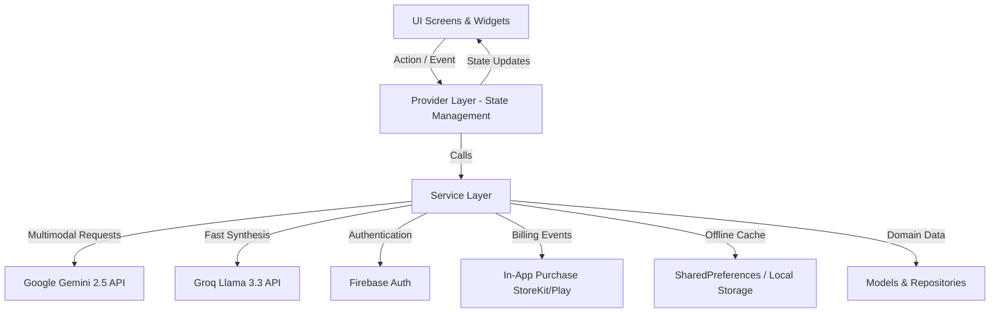

# Eloa 🔮 | AI-Powered Palmistry, Physiognomy & Dream Interpretation

<p align="center">
  
</p>

<p align="center">
  <strong>Next-Generation Multimodal AI Mobile Application for Esoteric & Morphological Analysis</strong>
</p>

<p align="center">
  <a href="https://flutter.dev"></a>
  <a href="https://dart.dev"></a>
  <a href="https://ai.google.dev"></a>
  <a href="https://firebase.google.com"></a>
  <a href="https://pub.dev/packages/provider"></a>
  <a href="LICENSE"></a>
</p>

<p align="center">
  <a href="#overview">Overview</a> •
  <a href="#key-features">Key Features</a> •
  <a href="#architecture">Architecture</a> •
  <a href="#tech-stack">Tech Stack</a> •
  <a href="#security--configuration">Security</a> •
  <a href="#getting-started">Getting Started</a> •
  <a href="#author--contact">Author</a>
</p>

---

## 📖 Overview

**Eloa** is an advanced cross-platform mobile application built with **Flutter**, fusing traditional Eastern and Islamic morphological wisdom (**İlmi Sima** & **Chiromancy / Palmistry**) with state-of-the-art **Multimodal Generative AI (Google Gemini 2.5 Flash & Groq Llama 3.3)**.

The app guides users through a structured camera capture process, extracts visual biometric indicators from hand and facial morphology, and generates comprehensive, high-resolution psychological, character, and destiny profile analyses.

> 🇹🇷 **Özet (TR):** Eloa, Flutter ile geliştirilmiş; Google Gemini multimodal yapay zeka modelleri ve geleneksel İlmi Sima & El analizi metodolojisini harmanlayan, Firebase Auth ve In-App Purchase mimarilerine sahip yeni nesil bir mobil uygulamadır.

---

## ✨ Key Features

### 🖐 1. Multimodal Palmistry & Morphological Analysis
- **Custom Viewfinder & Alignment Guides:** Interactive transparent silhouette overlays assist users in capturing palm photos with optimal focus, lighting, and angle.
- **Biometric Landmark Detection:** Real-time AI processing of key anatomical features including the Life Line, Head Line, Heart Line, Fate Line, and planetary mounts (Venus, Jupiter, Saturn, Sun, Mercury).
- **Dual-Hand Synthesis:** Analyzes both the passive hand (innate potential and genetic predispositions) and the active hand (current choices and realized potential).

### 👤 2. Physiognomy (İlmi Sima) Profiling
- Deep character and behavioral tendencies assessment derived from classical physiognomic principles.
- Structured category-based questions combined with computer-vision-assisted visual analysis.

### 🌙 3. Islamic & Psychological Dream Interpretation
- Context-aware natural language understanding powered by Gemini LLM.
- Analyzes recurring symbols, emotional undertones, and historical hermeneutic contexts to deliver nuanced, uplifting insights.

### 💎 4. In-App Monetization & Subscriptions
- Seamless integration with Google Play Billing & Apple StoreKit via `in_app_purchase`.
- Tiered monetization architecture supporting coin/token packages, single report unlocks, and VIP recurring subscriptions.

### 🔒 5. Authentication & Cloud Synchronization
- Firebase Authentication with one-tap Google Sign-In and anonymous guest checkout.
- Cloud synchronization with graceful offline fallbacks.

### 📱 6. Local-First Caching & Social Export
- Analysis history stored securely on-device with zero server latency.
- Visual card export utilizing `screenshot` and `share_plus` to generate shareable aesthetic cards for social media.

---

## 🏛 Architecture & Engineering Design

The project follows clean, modular **Layered Architecture** principles paired with the **Provider** state management pattern to guarantee separation of concerns, testability, and maintainability.



### 📂 Directory Structure

```plaintext
lib/
├── core/                  # Design tokens, theme, constants & environment configuration
│   ├── app_config.dart    # Centralized --dart-define credentials manager
│   ├── app_theme.dart     # Mystical dark palette, typography & glassmorphic styling
│   └── constants.dart     # Static assets, strings & UI constants
├── features/              # Feature-first modular packages
├── models/                # Domain models, analysis matrices & serialization logic
│   ├── analysis_category.dart
│   ├── analysis_data_manager.dart
│   └── analysis_history.dart
├── providers/             # State controllers (ChangeNotifier)
│   └── analysis_provider.dart
├── screens/               # Screen widgets & workflows
│   ├── camera_capture_screen.dart       # Live camera with custom overlays
│   ├── multi_photo_capture_screen.dart  # Multi-slot biometric guide capture
│   ├── advanced_result_screen.dart      # Rich interactive analysis dashboard
│   ├── dream_interpretation_screen.dart # NLP Dream interpreter UI
│   └── premium_screen.dart              # In-App Purchase showcase
├── services/              # External APIs, Hardware & Cloud services
│   ├── ai_analysis_service.dart         # Gemini Multimodal Vision engine
│   ├── auth_service.dart                # Firebase Auth & Google Sign-In
│   ├── dream_interpretation_service.dart# Generative text reasoning
│   ├── gemini_service.dart              # Groq / LLM communication
│   ├── history_storage_service.dart     # Local-first persistence
│   └── purchase_service.dart            # In-App Purchase event bus
└── widgets/               # Reusable UI components & custom painters
```

---

## 🛠 Tech Stack

| Domain | Technology / Package | Description |
| :--- | :--- | :--- |
| **Framework** | [Flutter](https://flutter.dev) (v3.3+) | Cross-platform UI toolkit |
| **Language** | [Dart](https://dart.dev) (v3.3+) | Strongly-typed, object-oriented language |
| **State Management** | [Provider](https://pub.dev/packages/provider) | Reactive dependency injection & state management |
| **Artificial Intelligence** | [Google Gemini 2.5 Flash](https://ai.google.dev) | Multimodal visual recognition & reasoning |
| **High-Speed LLM** | [Groq / Llama 3.3 70B](https://groq.com) | Real-time text synthesis & deep commentary |
| **Authentication** | [Firebase Auth](https://firebase.google.com) | Google Sign-In & credential management |
| **In-App Billing** | [in_app_purchase](https://pub.dev/packages/in_app_purchase) | Google Play Billing & Apple App Store purchases |
| **Hardware / Sensors** | [camera](https://pub.dev/packages/camera), [image_picker](https://pub.dev/packages/image_picker) | Camera control & image stream processing |
| **Persistence** | [shared_preferences](https://pub.dev/packages/shared_preferences), [path_provider](https://pub.dev/packages/path_provider) | Local-first encrypted caching |
| **UI & Aesthetics** | [google_fonts](https://pub.dev/packages/google_fonts), [flutter_svg](https://pub.dev/packages/flutter_svg) | Custom typography & scalable vectors |

---

## 🔐 Security & Secret Management

In compliance with enterprise-grade engineering standards, **no sensitive API keys or private certificates are stored directly in version control**.

Configuration values are injected at build/runtime using Flutter's compile-time environment flags (`--dart-define`).

### Environment Variables Template

See [`.env.example`](.env.example) for reference:

```bash
# Google Gemini Multimodal API Key
GEMINI_API_KEY=your_gemini_api_key_here

# Groq Fast Inference API Key
GROQ_API_KEY=your_groq_api_key_here
```

---

## 🚀 Getting Started

### Prerequisites
- [Flutter SDK](https://docs.flutter.dev/get-started/install) (3.3.0 or higher)
- [Android Studio](https://developer.android.com/studio) / [Xcode](https://developer.apple.com/xcode/)
- A Google Gemini API key from [Google AI Studio](https://aistudio.google.com/)

### 1. Clone the Repository
```bash
git clone https://github.com/furkankisisel/eloa.git
cd eloa
```

### 2. Install Dependencies
```bash
flutter pub get
```

### 3. Run with Environment Defines
```bash
flutter run \
  --dart-define=GEMINI_API_KEY=your_gemini_key \
  --dart-define=GROQ_API_KEY=your_groq_key
```

### 4. Build Release APK
```bash
flutter build apk --release \
  --dart-define=GEMINI_API_KEY=your_gemini_key \
  --dart-define=GROQ_API_KEY=your_groq_key
```

The compiled release artifact will be located at:
`build/app/outputs/flutter-apk/app-release.apk`

---

## 🧪 Testing & Code Quality

Run static analysis and unit tests:

```bash
# Run static analysis
flutter analyze

# Run unit and widget tests
flutter test
```

---

## 🎯 Engineering Highlights (Why This Project Matters)

- **Multimodal AI Prompt Engineering:** Implemented structured JSON output prompting with Google Gemini to guarantee type-safe deserialization without parser crashes.
- **Hardware Integration:** Crafted custom camera overlays matching palm geometry to dramatically minimize user photo-taking errors.
- **Defensive API Architecture:** Fallback mechanisms gracefully recover when users hit rate limits or experience flaky mobile network conditions.
- **Zero-Warning Code Quality:** Strict adherence to `flutter_lints` standards, clean imports, and zero hardcoded secrets.

---

## 📄 License

This project is licensed under the MIT License - see the [LICENSE](LICENSE) file for details.

---

## 👨‍💻 Author & Contact

**Furkan Kişisel**  
*Computer Engineering Student & Mobile Software Developer*

- 🌐 **GitHub:** [@furkankisisel](https://github.com/furkankisisel)
- 💼 **LinkedIn:** [Furkan Kişisel](https://linkedin.com/in/furkankisisel)
- 📧 **Email:** furkankisisel@gmail.com

---

<p align="center">
  <sub>Built with ❤️ using Flutter & Google Gemini AI</sub>
</p>
